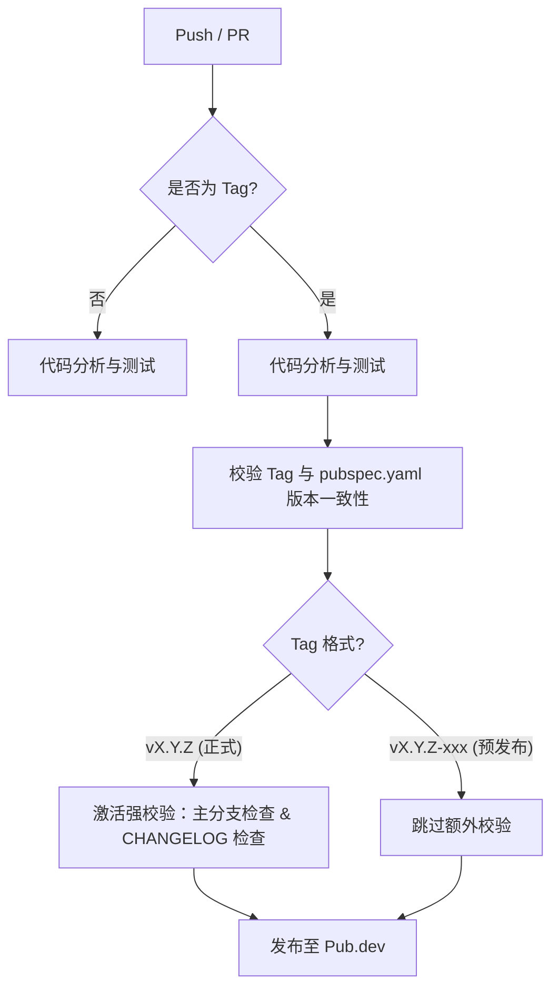

# Flutter/Dart CI/CD 自动化工作流

本项目提供了一套高度自动化且健壮的 GitHub Actions 工作流，用于 Dart 和 Flutter 项目的代码质量校验与发布。

## 核心设计：智能守门员机制

所有发布流程都遵循“分析先行”的原则，并由 Git Tag 驱动自动识别发布性质（正式版 vs 预发布版）。



## 工作流说明

### 1. 代码分析与测试
- **Dart**: `dart-analysis.yml`
- **Flutter**: `flutter-analysis.yml`
- **特性**：
    - **双版本并行**：同时在最低 SDK 和最新稳定版上运行。
    - **严格校验**：稳定版下强制校验格式及 `--fatal-infos`。
    - **自动过滤**：分析时自动排除 `example/`、`test/` 及生成的代码文件。

### 2. 全自动发布 (Smart Publish)
- **Dart**: `dart-publish.yml`
- **Flutter**: `flutter-publish.yml`
- **特性**：
    - **Tag 驱动**：根据 Tag 自动判断是正式发布（Formal Release）还是预发布（Pre-release）。
    - **版本强校验**：强制校验 Git Tag 中的版本号必须与 `pubspec.yaml` 保持一致，防止误操作。
    - **正式版强约束**：正式发布时，必须位于 `main` 分支，且 `CHANGELOG.md` 必须包含对应版本的更新说明。

---

## 如何使用

在你的项目根目录下创建 `.github/workflows/publish.yml`，参考以下极简配置：

### Dart 项目示例
```yaml
name: Publish to pub.dev

on:
  push:
    branches: ["**"]
    tags: ["v*"]

jobs:
  # 1. 守门员：分析通过后才执行后续
  analysis:
    uses: aymtools/flutter-ci/.github/workflows/dart-analysis.yml@main

  # 2. 全自动发布：内部自动识别正式/预发布
  publish:
    needs: [analysis]
    if: startsWith(github.ref, 'refs/tags/v')
    permissions:
      contents: read
      id-token: write
    uses: aymtools/flutter-ci/.github/workflows/dart-publish.yml@main
    with:
      main_branch_name: 'main' # 正式版校验的分支名，默认 main
```

### Flutter 项目示例
```yaml
name: Publish to pub.dev

on:
  push:
    branches: ["**"]
    tags: ["v*"]

jobs:
  # 1. 守门员
  analysis:
    uses: aymtools/flutter-ci/.github/workflows/flutter-analysis.yml@main

  # 2. 全自动发布
  publish:
    needs: [analysis]
    if: startsWith(github.ref, 'refs/tags/v')
    permissions:
      contents: read
      id-token: write
    uses: aymtools/flutter-ci/.github/workflows/flutter-publish.yml@main
```
